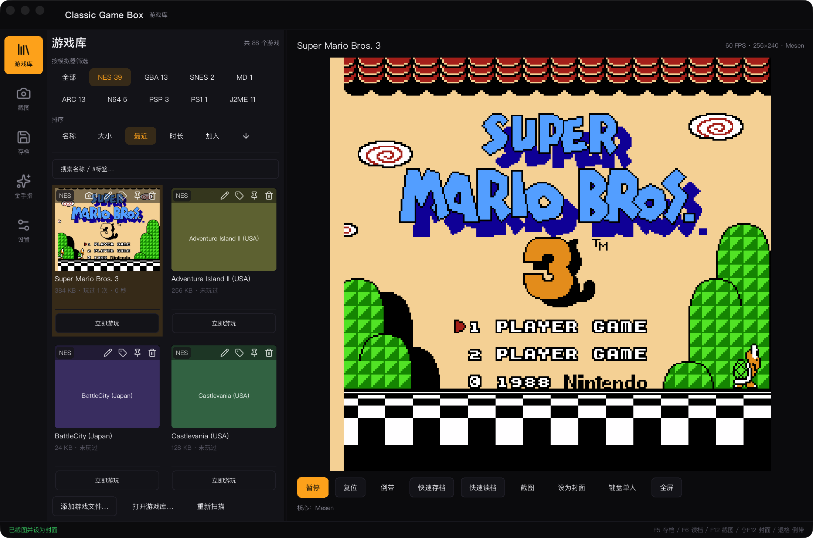

# Classic Game Box



跨平台的经典游戏机模拟器前端：**Rust + [igui](https://github.com/lazyfury/igui) + wgpu** 写的原生界面，
通过标准 **libretro** 契约加载第三方模拟器核心。打开即玩——把 ROM 加进游戏库，接上手柄或用键盘就行。

- **macOS**（主产品）：Swift 壳负责窗口，UI / 渲染 / 模拟器全在 Rust。
- **Windows**（实验性）：C++/Win32 壳负责窗口，同上；已在 Windows 11 虚拟机跑通。
- **不做自研模拟器**：只做 UI 与 libretro 兼容；唯一的自研 FC 核心 `custom_nes_core` 只作对照保留。

**目录**

- [支持的机种与核心](#支持的机种与核心)
- [快速开始](#快速开始)
- [使用说明](#使用说明)（[界面](#界面) · [快捷键](#游玩中的快捷键) · [键盘 / 手柄](#键盘与手柄) · [存档](#存档与即时存档) · [金手指](#金手指) · [画面](#画面后处理shader) · [截图](#截图与封面) · [全屏](#全屏)）
- [命令行参数](#命令行参数)
- [核心：下载还是自编译](#核心下载还是自编译)
- [自己构建 App](#自己构建-app)（[macOS](#macosswift-host) · [Windows](#windowscwin32-host)）
- [Windows 支持现状](#windows-支持现状)
- [自己构建核心](#自己构建核心)
- [开发与验证](#开发与验证)
- [目录结构](#目录结构)
- [常见问题](#常见问题)

---

## 支持的机种与核心

所有核心都从单一清单 [`cores/cores.json`](cores/cores.json) 加载，优先级为
`--core` > 单游戏覆盖 > 机种设置 > 清单首个核心。

| 机种 | 文件扩展名 | 核心（清单 key） | 说明 |
|---|---|---|---|
| NES / FC | `.nes` | **Mesen**（默认）、Nestopia、`custom_nes_core`（自研） | 软件渲染 |
| Game Boy / Color / Advance | `.gb` `.gbc` `.gba` | **mGBA** | 软件渲染，RGB565 |
| Super Nintendo / SFC | `.sfc` `.smc` `.fig` `.swc` | **Snes9x** | 软件渲染；常规游戏无需 BIOS |
| Mega Drive / Genesis / SMS / GG / SG-1000 | `.md` `.gen` `.smd` `.bin` `.sms` `.gg` `.sg` | **Genesis Plus GX**、PicoDrive | 软件渲染，RGB565 |
| Arcade | `.zip` | **FinalBurn Neo** | 标准 Neo Geo 套（按 CRC 读取） |
| Nintendo 64 | `.z64` `.n64` `.v64` | **ParaLLEl-N64** | 硬件渲染（OpenGL / GLideN64） |
| PlayStation Portable | `.iso` `.cso` `.pbp` `.chd` | **PPSSPP** | 硬件渲染（OpenGL） |
| Sony PlayStation | `.cue` `.ccd` `.toc` `.m3u` `.img` | **Beetle PSX HW** | 硬件渲染（OpenGL）；BIOS 可选 |
| J2ME (Java ME) | `.jar` `.kjx` | **FreeJ2ME-Plus** | 软件渲染；无即时存档，见[已知缺口](#常见问题) |

> 扩展名冲突时（如 `.bin` 属于 Genesis、`.iso/.chd/.pbp` 属于 PSP），可以在游戏卡片右键
> **「选择机种…」** 按游戏覆盖；**「选择核心…」** 可按游戏覆盖核心。两者都记在库里，
> 重新扫描不会覆盖。

## 快速开始

### 直接用发布版

从 [Releases](https://github.com/lazyfury/classic-game-box/releases) 下载 `ClassicGameBox-*.zip`，
解压后把 `Classic Game Box (Swift).app` 拖进「应用程序」。App **不预装核心**，第一次用到某个机种时，
在**设置 → 下载核心**里下载，或在库页的「缺少核心」卡片一键下载（也可用命令行，见下）。

> **首次打开被 Gatekeeper 拦下**：App 是本地编译 + ad-hoc 签名、**未公证**。右键点图标选
> **打开**即可；或执行
> `xattr -dr com.apple.quarantine "Classic Game Box (Swift).app"`。

### 从源码运行（macOS）

需要 macOS（Apple Silicon）、Rust stable、Xcode 命令行工具；`igui` 是 git 依赖，首次构建需联网。

```bash
cargo build                                   # → target/debug/libcgb_app.a（Swift 链接用）
macos/scripts/run.sh                          # 打开库界面
macos/scripts/run.sh /path/to/mario.nes       # 直接开始
macos/scripts/run.sh mario.nes --core mesen   # 强制用某个核心
```

游戏需要核心。想本地直接玩，先构建一份到 `cores/dist`：

```bash
./scripts/build-cores.sh                      # 全部核心（首次约几分钟，需联网）
./scripts/build-cores.sh --minimal            # 只构建可随包分发的核心
./scripts/build-cores.sh --only mesen,mgba    # 指定核心
```

> 仓库**不包含任何 ROM**（版权与体积）。请使用你合法拥有的游戏文件。

## 使用说明

### 界面

三栏布局：

- **左栏**：导航（游戏库 / 截图 / 存档 / 金手指 / 设置）与筛选。
- **中栏**：游戏库网格。顶部按机种筛选、按名称 / 大小 / 最近 / 时长 / 加入排序、搜索（
  `名称` 或 `#标签`）；每张卡片可「立即游玩」、置顶、改名、编辑标签、设封面、删除。
- **右栏**：运行中的游戏画面与操作按钮（暂停 / 复位 / 倒带 / 快速存档 / 快速读档 / 截图 /
  设为封面 / 键盘单人 / 全屏）。

库底部的按钮：**添加游戏文件…**、**打开游戏库…**、**重新扫描**。游戏库是**单库、自包含**的：
数据库、截图、存档、金手指都在库根下，整个文件夹拷走即备份。平时不会自动重扫，
改动 ROM 后手动点「重新扫描」即可。

### 游玩中的快捷键

| 快捷键 | 作用 |
|---|---|
| `F5` | 快速存档（3 档 LIFO 轮转，`fast01` 最新） |
| `F6` | 快速读档（读最新的一档，不弹出） |
| `F1` / `F2` / `F3` | 存入固定手动槽 1 / 2 / 3 |
| `Shift`+`F1` / `F2` / `F3` | 读取固定手动槽 1 / 2 / 3 |
| `F12` | 截图 |
| `Shift`+`F12` | 截图并直接设为封面 |
| `退格`（按住） | 倒带（每 2 帧回退，最多约 10 秒） |
| `F11` | 切换全屏（`Esc` 退出全屏） |
| `Esc` | 暂停游戏 / 关闭弹窗，把键盘交还给界面 |

### 键盘与手柄

默认键盘布局（可在设置页改键）：

| 功能 | 键 |
|---|---|
| 方向 | 方向键 或 `W` `A` `S` `D` |
| B / A | `Z`、`J` / `X`、`K` |
| Start / Select | `Enter`、`Space` / `Tab` |

各机种会自动补齐按键：Genesis 的 `C`/`X`/`Y`/`Z`/`Mode`，SNES 的 `Y`/`X`/`L`/`R`，
N64 的 C 键与 Z，PSP / PS1 的方块、三角、L/R，J2ME 的数字键与软键等。**双人**时 1P 用
WASD 一侧、2P 用方向键一侧。

手柄走系统原生输入：macOS 用 Apple `GameController`（蓝牙 Xbox 手柄映射正确），
Windows 计划用 XInput。插上未分配的手柄后按 **Start** 认领端口；长按主手柄 **Select**
请求整机复位。

### 存档与即时存档

- **电池存档**：`.srm` 自动写回库中（存档目录随库走）。
- **快速存档（F5/F6）**：3 档轮转，新的在前，旧的依次下移，超出丢最旧；按 core 隔离。
- **手动槽（F1–F3）**：固定槽位，适合关键进度。存档会带缩略图，可在「存档」页管理。

### 金手指

支持 libretro 的 `.cht` 金手指文件，在「金手指」页启用 / 停用 / 编辑。文件同样存放在库中，
删除游戏会连存档与金手指一起清理。

### 画面后处理（shader）

设置页可选画面滤镜：**扫描线**、**CRT**、**LCD 网格**、**锐化**（基于 igui 的
`TextureEffect`）。也可设置整数倍缩放与背景。

### 截图与封面

- `F12` 截图并存入库，「截图」页可多选删除、设为封面、大图预览。
- `Shift`+`F12` 截图并直接设为封面。
- 游戏卡片右键菜单可单独设置 / 更换封面。

### 全屏

`F11` 或右栏的「全屏」按钮进入全屏游玩；此时只挂载游戏视图（库网格与侧栏不入树），
`Esc` 退出。

## 命令行参数

宿主（Swift / C++）把同样的参数传给 `cgb_host_start`，所以下列参数在 macOS 与 Windows 都可用。

```text
classic-game-box [--rom <path>] [--core <key|module>] [--library-dir <path>]
                 [--theme <name>] [--light] [--selfcheck]
                 [--force-update] [--search-core <q>] [--download-core <name>]
                 [--core-base-url <url>]
```

| 参数 | 说明 |
|---|---|
| `--rom <path>` / 位置参数 | 启动即加载这个 ROM。 |
| `--core <key\|module>` | 强制核心：清单 key（`mesen`、`mgba`、`nestopia`…）或任意 `.dylib` / `.so` / `.dll` 路径。 |
| `--library-dir <path>` | 指定游戏库根目录（数据库 / 截图 / 存档 / 金手指都在其下），并记住该选择。 |
| `--theme <game\|default>` | 主题：`game` 是自定义风格（默认），`default` 是库内置配色。 |
| `--light` | 使用浅色外观（默认深色）。 |
| `--selfcheck` | 无头自检（路径 / 库 / 设置 / 核心 / 图标）后退出，不开窗口。 |
| `--force-update` | 从 libretro buildbot 刷新「下载源」缓存后退出。 |
| `--search-core <q>` | 在（可离线访问的）核心目录里搜索后退出。 |
| `--download-core <name>` | 下载指定核心到 app data 并试用加载后退出。 |
| `--core-base-url <url>` | 覆盖下载源地址（默认 libretro nightly buildbot）。 |

## 核心：下载还是自编译

**发布版不打包核心**，只带完整的 `cores/cores.json`：用到时从 libretro buildbot 运行时下载。

### 运行时下载（推荐）

- **设置 → 下载核心**：搜索框输入名称，点「下载」，后台线程下载并显示进度；「刷新下载源」
  重新拉取目录。
- 库页的**「缺少核心」**卡片会为缺失机种推荐并一键下载。
- 命令行：

```bash
classic-game-box --search-core snes       # 搜索（用内置快照，可离线）
classic-game-box --force-update           # 刷新下载源缓存
classic-game-box --download-core mame     # 下载并验证可加载
```

下载落到 `<app data>/cores/` 并登记到 `downloaded.json`，与该机种的核心选择器合并。
内置快照 `cores/catalog.json` 编译进二进制（离线可搜），用户缓存优先；
`./scripts/update-core-catalog.sh` 可重新生成快照。

### 自己构建核心

第三方源码按需 clone 到 `cores/sources/`（已 gitignore），模块产物进 `cores/dist/`（已 gitignore）。
每个核心一个构建脚本 `cores/<name>/build.sh`：

```bash
./scripts/build-cores.sh                      # 运行所有 cores/*/build.sh
./scripts/build-cores.sh --minimal            # 可随包分发的集合
./scripts/build-cores.sh --only mesen,mgba    # 指定列表
./scripts/build-cores.sh --skip-mgba          # 跳过需要 cmake 的 mGBA
./cores/mesen/build.sh                        # 单独构建一个
```

- **`--minimal`** 构建 `mesen mgba custom_nes_core freej2me_plus`（见
  [`scripts/core-profiles.sh`](scripts/core-profiles.sh)）：许可允许分发、且 buildbot 上
  没有 arm64 构建的核心。
- 其余核心（`snes9x`、`genesis_plus_gx`、`picodrive`、`fbneo`）为**非商业许可，不可转售**，
  只建议本地构建、切勿随包分发。
- **两个核心没有 buildbot 构建，必须自己编译**：
  - `custom_nes_core`（自研 FC 核心）→ `./cores/custom_nes_core/build.sh`
  - `freej2me_plus`（Java ME，需要 JDK）→ `./cores/freej2me_plus/build.sh`，
    额外产出 jar + 精简 JRE 到 `cores/dist/freej2me_plus/`

构建细节（各核心的平台 / 工具链差异、踩坑）见 [`cores/README.md`](cores/README.md)。

### 打包时带上核心

`macos/scripts/package.sh` 会把 `cores/dist/*.dylib`（以及 freej2me / ppsspp 的附属文件）
复制进 `Contents/Resources/cores/`：

```bash
./scripts/build-cores.sh --minimal
macos/scripts/package.sh                      # 带核心
macos/scripts/package.sh --no-cores           # 只带 cores.json（发布版形态）
macos/scripts/package.sh --open               # 打完直接运行
```

## 自己构建 App

仓库是两个原生壳共用一份 Rust 应用库：

```
┌──────────────────────┐         ┌─────────────────────────────────┐
│ macOS: Swift (`macos/`) │  C ABI  │ Rust (`src/`, `crates/`)         │
│ Windows: C++ (`windows/`)│◀──────▶│ igui UI + wgpu + libretro 模拟器  │
│ 只做窗口与事件          │         │ 产出 libcgb_app.a / cgb_app.lib  │
└──────────────────────┘         └─────────────────────────────────┘
```

FFI 边界**包含 UI**：壳不绘制、不布局、不感知控件，只创建窗口、转发事件、按需请求帧。

### macOS（Swift host）

**依赖**：macOS（Apple Silicon）、Rust stable、Xcode 命令行工具、原生核心。

```bash
# 一次性：构建核心
./scripts/build-cores.sh --minimal

# 构建 Rust 静态库 + Swift 可执行文件
macos/scripts/build.sh                       # debug
CGB_RUST_PROFILE=release macos/scripts/build.sh

# 运行
macos/scripts/run.sh                         # 开库界面
macos/scripts/run.sh /path/to/game.nes       # 直接开始
macos/scripts/run.sh --library-dir ~/Games   # 指定库

# 打包 .app
macos/scripts/package.sh                     # → dist/Classic Game Box (Swift).app
```

也可以手动两步（SwiftPM）：`cargo build` 产出 `target/debug/libcgb_app.a`，再
`swift build --package-path macos` 产出 `macos/.build/debug/cgb-mac`。

### Windows（C++/Win32 host）

实验性，但已能在 Windows 11 虚拟机上跑通。两条构建路线：

**A. 原生 MSVC（推荐，但尚未实测）** —— 需要 Windows 10+、Visual Studio 2022、CMake、
Rust 工具链、原生核心 `cores/dist/*.dll`。

```bat
rem 在仓库根目录
cargo build                                  rem target\debug\cgb_app.lib
cmake -S windows -B windows\build -A x64
cmake --build windows\build --config Debug
windows\build\Debug\cgb-win.exe
```

或直接用脚本：

```bat
windows\scripts\build.bat                    rem 构建 → cgb-win.exe
windows\scripts\run.bat                      rem 打开库界面
windows\scripts\run.bat path\to\game.nes     rem 直接开始
windows\scripts\run.bat --library-dir C:\Games
```

**B. 从 macOS / Linux 用 MinGW 交叉编译（已实测可在 VM 运行）** —— 需要
`brew install mingw-w64`，产出**自包含**的 `windows/build-mingw/cgb-win.exe`
（静态链接，无 GCC 运行库 DLL）：

```bash
windows/scripts/cross-build-mingw.sh
```

在没有 Windows 的机器上也可以只做语法检查：

```bash
brew install mingw-w64
windows/scripts/syntax-check.sh             # mingw-w64 -fsyntax-only -Wall -Wextra
```

## Windows 支持现状

**已在 Parallels Windows 11 虚拟机上实测**（MinGW 交叉编译产物，DX12 走 "Parallels Display
Adapter"）：

- ✅ 窗口创建、打开
- ✅ 游戏库界面渲染
- ✅ 消息循环在**反复 resize** 下稳定

针对 Windows 修过两个专属问题（详见 [`windows-host-plan.md`](docs/architecture/windows-host-plan.md)）：

- DX12 的 `ResizeBuffers` 在后备缓冲仍被引用时失败 → **已修在 igui 上游 `v0.3.1`**，本仓库已升级依赖。
- wgpu 校验错误跨越 `extern "C"` 边界会 `__fastfail`（`0xc0000409`）→ host 改用
  `on_uncaptured_error` 打印，不再让进程崩溃。

**尚未在 Windows 上实测**（代码已写，待人眼验收）：

- ⌛ 键盘 / 指针 / IME / 拖放 / 全屏
- ⌛ XInput 手柄
- ⌛ MSVC 构建（`windows/scripts/build.bat`）
- ⌛ 强制 WARP 软件光栅器（虚拟机兜底）
- ⌛ 硬件 GL 核心（N64 / PSP / PS1）需要离屏 **WGL** 上下文，目前只承诺软件核心
  （NES / SNES / GB / Genesis / FBNeo / J2ME）

音频在 Windows 复用同一份 Rust `cpal`（WASAPI），无需额外工作。

## 自己构建核心

完整流程见 [`cores/README.md`](cores/README.md)：添加一个核心 = 一个 `cores/<name>/build.sh`
+ 一条 `cores/cores.json` 清单行；新机种再加一处小型 Rust 改动。常用命令：

```bash
cp cores/build.sh.example cores/<name>/build.sh   # Makefile 或 CMake 两种模板
chmod +x cores/<name>/build.sh
./cores/<name>/build.sh                           # → cores/dist/<name>_libretro.dylib
```

`cores/README.md` 记录了每个核心的构建形态（Makefile / CMake / submodule / buildbot）、
macOS 26+ 的部署目标坑、以及 frontend 需要补齐的环境命令（像素格式、`need_fullpath`、
`SET_HW_RENDER`、core options、system/save 目录等）。

## 开发与验证

每阶段门槛（格式 + lint + 测试）：

```bash
./scripts/dev.sh
# 等价于：
cargo fmt --all -- --check
cargo clippy --workspace --all-targets -- -D warnings
cargo test --workspace
```

- 不写截图 / 录屏测试：UI 手感由人看；UI 回归用 `igui_backend_recording` 录 `DrawList`
  + `igui_profile::inspect`，模拟器侧用假 frontend 单测。
- `CGB_PERF=1` 打印性能打点。
- UI 栈 `igui` 以 **git 依赖**固定到 `v0.2.0` 的 commit（`Cargo.lock` 锁定），无需相邻 checkout。

## 目录结构

| 路径 | 内容 |
|---|---|
| `src/` | 根包 `cgb-app`：`ui` 视图、`app` 应用逻辑、`library` 游戏库、`cores` 清单/下载、`audio`、`host` 契约、`native` 共享原生 host + C ABI |
| `crates/cgb-libretro/` | libretro front end + 纯域类型（`system` / `joypad` / `input` / `core_choice`） |
| `cores/` | 核心清单、下载目录快照、各核心 `build.sh` 与 `sources/` / `dist/` |
| `custom_nes_core/` | 自研 FC 核心 C++ 源码（独立 CMake 项目，只读对照） |
| `macos/` | Swift/macOS 壳（窗口 / 事件 / GameController） |
| `windows/` | C++/Win32 壳（窗口 / 消息循环 / XInput） |
| `assets/` | 图标、配色、随包 BIOS |
| `scripts/` | `dev.sh`、`build-cores.sh`、`update-core-catalog.sh` |
| `docs/` | 架构与计划文档 |

## 常见问题

**打开时提示缺少核心？**
发布版不带核心。去**设置 → 下载核心**（或库页「缺少核心」卡片）下载；离线的核心可用
`--download-core`，或按[自己构建核心](#自己构建核心)编译后放进 `cores/dist/`。

**游戏识别成了错误的机种？**
在游戏卡片右键 **「选择机种…」** 覆盖；核心不对就用 **「选择核心…」**。两者都写进库，
重新扫描不会覆盖。

**J2ME（`freej2me_plus`）有哪些限制？**
声音由 Java 子进程直接输出到系统音频，**不经过 `cgb-audio`**，因此暂停不静音、应用内音量无效；
**无即时存档 / 倒带**；核心请求的键盘 / 触摸回调宿主未接（手柄可玩）。它也不在 buildbot 上，
必须自己编译。

**Nestopia 的画面异常？**
Nestopia 的 Blargg NTSC filter 在本进程内先跑过 Mesen 后会段错误，清单已默认将其关闭，
因此输出 256×224。改用 Mesen 即可。

**`custom_nes_core` 是什么？**
自研 FC 核心，源码在 [`custom_nes_core/`](custom_nes_core/)（独立 CMake 项目）。
产品不使用它的 `fc_*` 私有扩展，只按标准 libretro 加载，作为对照与兼容性测试基准。

**App 被 Gatekeeper 拦截？**
未公证。右键 → **打开**，或 `xattr -dr com.apple.quarantine "Classic Game Box (Swift).app"`。

---

## 关于本仓库 / 迁移状态

本仓库正从 **Electron + WebAssembly + 自研核心** 迁移到 **原生 Rust（igui）+ 标准 libretro**。
权威设计见 [`docs/architecture/quill-native-migration.md`](docs/architecture/quill-native-migration.md)，
旧架构来龙去脉见 [`docs/architecture/libretro-migration.md`](docs/architecture/libretro-migration.md)。

| 阶段 | 内容 | 状态 |
|---|---|---|
| Q0 | 计划、目录结构、Rust 工作区骨架 | ✅ |
| Q1 | Mesen 原生 arm64 + dlopen + 出画面 + 键盘 | ✅ |
| Q2 | 音频（cpal）+ Swift `GameController` 手柄 + 存档 | ✅ |
| Q3 | 库模型重建（diesel / 单库自包含 / 截图 / 标签 / 核心覆盖） | ✅ |
| Q4 | 多机种接入（SNES / Sega / 街机 / N64 / PSP / PS1 / J2ME） | ✅ |
| Q5 | 打包 `.app`、核心运行时下载、无头自检 | ✅ |
| Q6 | 输入对齐、即时存档、金手指、倒带、shader、core options、全屏 | ✅ |
| — | Windows（C++/Win32）壳 | 🔧 实验性，窗口 + 库界面 + resize 已实测 |
| — | 分享游戏数据包 | 📋 计划中 |

许可：MIT。仓库内第三方核心各自遵循其原始许可（如 Mesen 为 GPLv3、mGBA 为 MPL-2.0），不随本项目的 MIT 授权改变；打包或分发前请核对 [`cores/README.md`](cores/README.md)。
